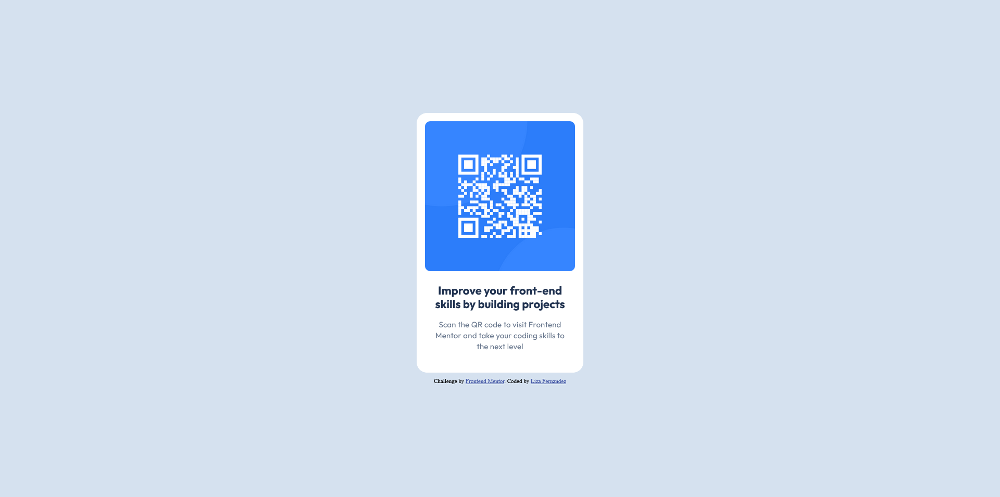

# Frontend Mentor - QR code component solution

This is a solution to the [QR code component challenge on Frontend Mentor](https://www.frontendmentor.io/challenges/qr-code-component-iux_sIO_H). Frontend Mentor challenges help you improve your coding skills by building realistic projects.

## Table of contents

- [Overview](#overview)
  - [Screenshot](#screenshot)
  - [Links](#links)
- [My process](#my-process)
  - [Built with](#built-with)
  - [What I learned](#what-i-learned)
  - [Continued development](#continued-development)
  - [Useful resources](#useful-resources)
- [Author](#author)

## Overview

### Screenshot

### Links

- Solution URL: [https://www.frontendmentor.io/solutions/qr-code-challenge-using-html-and-css-Ojt6snUHJL](https://www.frontendmentor.io/solutions/qr-code-challenge-using-html-and-css-Ojt6snUHJL)

- Live Site URL: [https://solution-to-qr-code-challenge.netlify.app](https://solution-to-qr-code-challenge.netlify.app)

## My process

### Built with

- HTML5
- CSS custom properties
- Flexbox
- Mobile-first workflow

### What I learned

While working through this project, I learned to commit and push my work to a git repository through VS Code and the terminal. I was able to practice using a figma design and style guide as references when styling the website using CSS. Overall, my major learnings outcomes from this project was reinforcing my knowledge of HTML and CSS, as well as my ability to create a website from a reference.

### Continued development

For future projects, I would like to continue focusing on reinforcing my knowledge in HTML and CSS. In particular, I would like to focus on using flexbox, custom CSS properties and making responsive websites. Adding javascript to future projects is also an area I would like to focus on in the future.

### Useful resources

- [W3 Schools](https://www.w3schools.com/css/css3_variables.asp) - I wanted to create custom CSS variables for the colors from the style guide provided with the challenge, but required a refresher on how to create and use them. This website was helpful in refreshing my knowledge on the topic.

- [nekoCalc](https://nekocalc.com/px-to-rem-converter) - In order to make my project more responsive and improve accessiblity, I used this to convert the px sizes I used to rem

## Author

- Website - [Liza Fernandez](https://lizafernandez.dev)
- Frontend Mentor - [@aelvanna](https://www.frontendmentor.io/profile/aelvanna)
